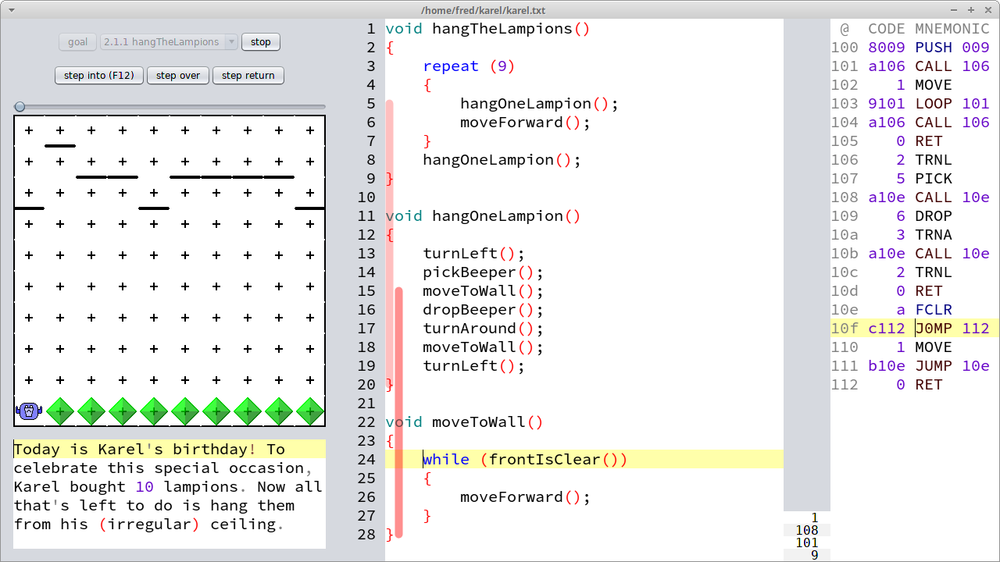
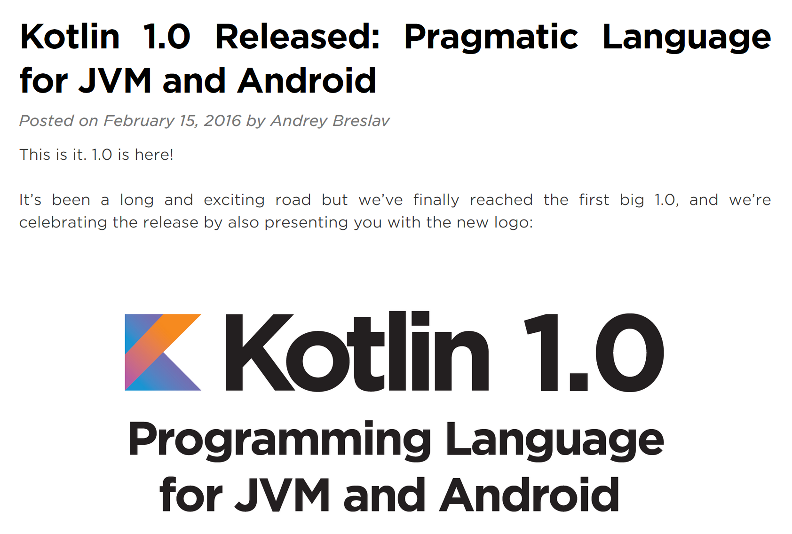
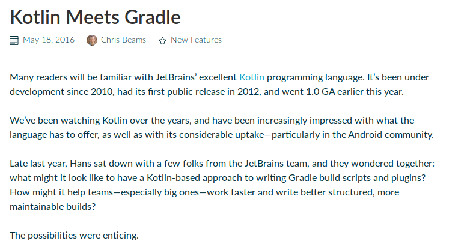
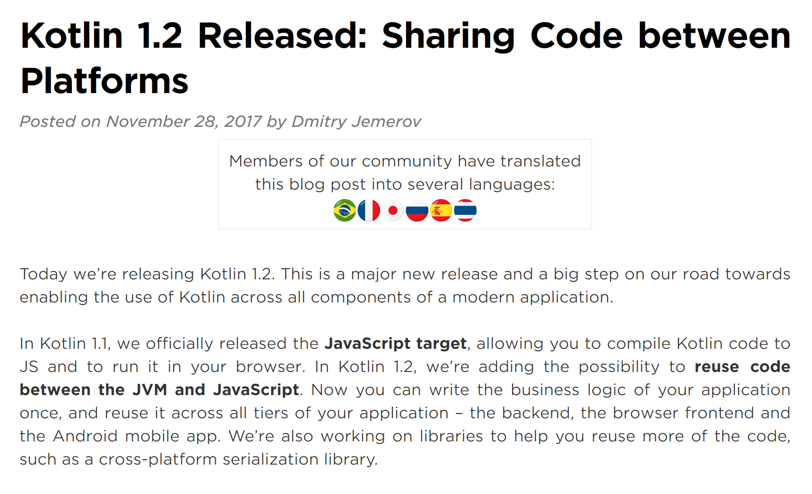
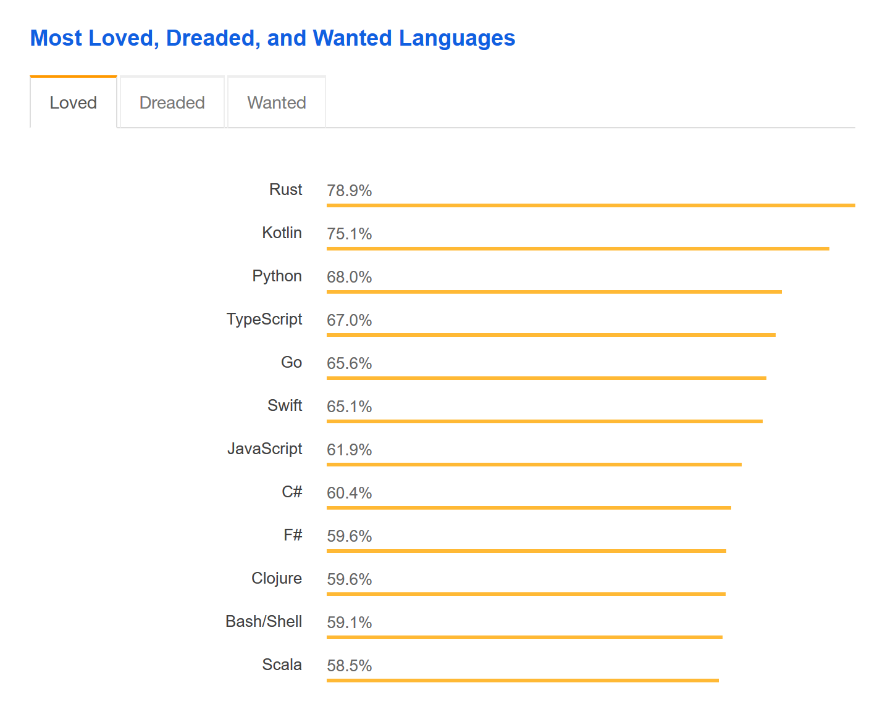

# Kotlin

## Agenda

* ~60 minutes presentation
* ~120 minutes mob programming

> **Rich Hickey:** If you want everything to be familiar,  
> you will never learn anything new because it can't be  
> significantly different from what you already know.


## Kotlin in a nutshell

* "Java without the boilerplate"
* Killer features:
  * Null-safety
  * Data classes
  * Extension functions
* Compilation targets:
  * JVM 6/8 bytecode (excellent Kotlin&#8596;Java interop)
  * EcmaScript 5.1 (2011)
  * LLVM-IR (experimental)
* https://kotlinlang.org

## Birth


```text
                                                                                        1.1    1.3
    Java                            Scala                Clojure  Kotlin            1.0 |  1.2 |
    |                               |                    |        |                 |   |  |   |
|---+---+---+---+---|---+---+---+---+---|---+---+---+---+---|---+---+---+---+---|---+---+---+---+---|
95                  00  |               05                  10        |         15         |        20
                    |   IntelliJ IDEA                                 |          |         |
                    |                                                 Karel      skorbut   Karel
                    JetBrains                                        (Scala)     (Kotlin) (Kotlin)
```




> **Dennis Ritchie:** The only way to  
> learn a new programming language  
> is by writing programs in it.

## Milestones









### [Stack overflow developer survey 2018](https://insights.stackoverflow.com/survey/2018/#most-loved-dreaded-and-wanted)



## Hello World

```kotlin
fun main(args: Array<String>): Unit {
    println("Hello Kotlin!");
}
```

* Dedicated `fun` keyword for functions
* Top-level functions (`main`, `println`)
* Classic `name: type` declaration syntax
* No special syntax for arrays
  * `args` array can be omitted
* `Unit` is Kotlin-speak for `void`
  * Return type `Unit` can be omitted
* Semicolons are optional

```kotlin
fun main() {
    println("Hello Kotlin!")
}
```

## Type system

### Primitive types

* `Boolean`
* `Byte`
* `Char`
* `Short`, `Int`, `Long`
* `Float`, `Double`

### Boxing

* `Int` is either `int` or `Integer`, depending on context:

```kotlin
fun addNumbers(numbers: List<Int>): Int {
                       // Integer   int
    var result = 0
             // int
    for (x in numbers) {
        result += x
    }
    return result
}
```

### `Any` is the new `Object`

* Every class without an explicit parent inherits from `Any`
* `Any` only has 3 methods:
  * `equals`
  * `hashCode`
  * `toString`
* `Object` has 5 more methods related to concurrency:
  * `notify`
  * `notifyAll`
  * `wait` (3 overloads)

## Control structures

### `if`

```kotlin
fun digitOrNumber(x: Int): String {
    if (x in 0..9) {
        return "digit"
    } else {
        return "number"
    }
}

fun digitOrNumber(x: Int): String {
    return if (x in 0..9) "digit" else "number"
}

fun digitOrNumber(x: Int) = if (x in 0..9) "digit" else "number"
```

* Many statements in Java are expressions in Kotlin
* It is usually a bad idea to omit public return types
* Omit braces only for trivial function bodies

### `when`

```kotlin
fun howMany(x: Int): String = when (x) {
    0 -> "none"
    1 -> "one"
    2 -> "two"
    else -> "many"
}

fun describe(x: CharSequence): String = when(x) {
    is String -> "String"
    is StringBuilder -> "StringBuilder"
    is StringBuffer -> "StringBuffer"
    else -> "some other CharSequence"
}
```

## Can you spot the bug?

```java
public static void login() { 
    Scanner scanner = new Scanner(System.in);
    String password;
    do {
        System.out.print("Password? ");
        password = scanner.nextLine();
    } while ("java" != password);
    System.out.println("Welcome to the system!");
}
```


### Sane equality

```kotlin
fun login() {
    val scanner = Scanner(System.`in`)
    var password: String
    do {
        print("Password? ")
        password = scanner.nextLine()
    } while ("kotlin" != password)
    println("Welcome to the system!")
}
```

* `val` is like `var`, but cannot be rebound
  * like `final var` in Java 10
* Kotlin does not have a `new` keyword
* Clashing keywords can be escaped with backticks
* `==` and `!=` on references delegates to `equals`
* Object identity can be tested with `===` and `!==`

## Value objects

```java
public class Name {
    private final String forename;
    private final String surname;

    public Name(String forename, String surname) {
        Objects.requireNonNull(forename);
        Objects.requireNonNull(surname);
        this.forename = forename;
        this.surname = surname;
    }

    public String getForename() {
        return forename;
    }

    public String getSurname() {
        return surname;
    }

    @Override
    public boolean equals(Object obj) {
        if (this == obj) return true;
        if (!(obj instanceof Name)) return false;
        Name that = (Name) obj;
        return this.forename.equals(that.forename)
            && this.surname.equals(that.surname);
    }

    @Override
    public int hashCode() {
        return forename.hashCode() * 31 + surname.hashCode();
    }

    @Override
    public String toString() {
        return "Name(forename=" + forename
                 + ", surname=" + surname + ")";
    }
}
```

### Data classes

```kotlin
data class Name(val forename: String,
                val surname: String)
```

A data class auto-generates the following members:
* Constructor
* Getters
* Setters (for `var` fields)
* `equals`
* `hashCode`
* `toString`
* `copy` method (functional 'setter')
* `componentN` methods (for destructuring)

## Nullable types

```kotlin
fun mustPassString(s: String) {
    // ...
}

fun canPassString(s: String?) {
    // ...
}

fun main() {
    mustPassString("hello")
    canPassString("world")

    mustPassString(null) // compile-time error
    canPassString(null) // okay
}
```

* `String?` is a supertype of `String` and `null`

### `NullPointerException` is very rare in Kotlin

```kotlin
fun mustPassString(s: String) {
    val n = s.length

    if (s != null) { // warning: condition is always true
        val m = s.length
    }
}

fun canPassString(s: String?) {
    val n = s.length // compile-time error

    if (s != null) {
        val m = s.length
    }
}
```

* Inside the `if` block, the type of `s` is adjusted from `String?` to `String`
  * flow-sensitive typing

```kotlin
fun nullSafeLengthVerbose(s: String?): Int {
    return if (s != null) s.length else 0
}

fun nullSafeLengthConcise(s: String?): Int {
    return s?.length ?: 0
}
```

### `copy` / named arguments

```kotlin
val jg = Name("James", "Gosling")

val rg = jg.copy(forename = "Ryan")
```

* The `copy` method has default parameters for all fields
* We pick new values via named arguments

```kotlin
fun copy(forename: String = this.forename,
          surname: String = this.surname): Name {
    return Name(forename, surname)
}
```

### Destructuring

```kotlin
fun printNames(names: List<Name>) {
    for ((fore, sur) in names) {
        println(sur + ", " + fore)
    }
}
```

### String interpolation

```kotlin
fun printNames(names: List<Name>) {
    for ((fore, sur) in names) {
        println("$sur, $fore")
    }
}
```

## Extension functions

```kotlin
fun String.reverse(): String {
    return StringBuilder(this).reverse().toString()
}

fun main() {
    println("A man, a plan, a canal, panama".reverse())
}

fun String?.nullSafeLength(): Int {
    return this?.length ?: 0
}

fun String?.orEmpty(): String {
    return this ?: ""
}
```
* Extension functions are compiled to static helper methods with an additional `$receiver` parameter
* Inside an extension function, only the public interface of the `$receiver` is available

## Function types and lambdas

```kotlin
/**
 * Returns a list containing only elements matching the given [predicate].
 */
public inline fun <T> Iterable<T>.filter(predicate: (T) -> Boolean): List<T>

fun main() {
    val languages = listOf("Java", "Scala", "Kotlin")

    val cool1 = languages.filter({ lang -> lang.length > 4 })

    val cool2 = languages.filter { lang -> lang.length > 4 }

    val cool3 = languages.filter {           it.length > 4 }
}
```

## Custom control structures

```kotlin
public inline fun repeat(times: Int, action: (Int) -> Unit) {
    for (index in 0 until times) {
        action(index)
    }
}

fun main() {
    repeat(10) {
        println(it)
    }
}
```

## Generics

### Why does this not compile?

```java
public static List<Object> randomList() {
    if (Math.random() < 0.5) {
        return new ArrayList<String>();
    } else {
        return new ArrayList<Integer>();
    }
}
```


### For type-safety!

* A subtype has all the operations of its supertype(s)
* `List<Object>` has an operation `void add(Object)`
* `List<String>` has no such operation
* Hence, `List<String>` is not a `List<Object>`

### Java Generics have use-site variance

```java
public static List<? extends Object> randomList() {
    if (Math.random() < 0.5) {
        return new ArrayList<String>();
    } else {
        return new ArrayList<Integer>();
    }
}
```
> **Joshua Bloch:** We simply cannot afford another wildcards

```java
public static <T extends Object & Comparable<? super T>> T max(Collection<? extends T> coll)
```

### Kotlin Generics have declaration-site variance

```kotlin
fun randomList(): List<Any> {
    if (Math.random() < 0.5) {
        return ArrayList<String>()
    } else {
        return ArrayList<Int>()
    }
}
```

* Kotlin Lists are read-only, hence this is type-safe:

```kotlin
/**
 * Methods in this interface support only read-only access to the list;
 * read/write access is supported through the [MutableList] interface.
 * @param E the type of elements contained in the list.
 * The list is covariant on its element type.
 */         // ~~~~~~~~~
public interface List<out E> : Collection<E> {
                   // ~~~
```

## Mob programming


